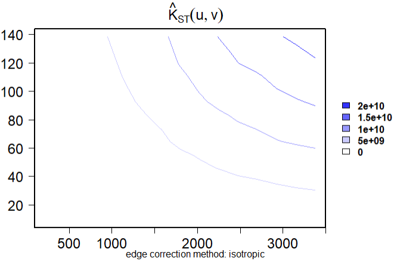
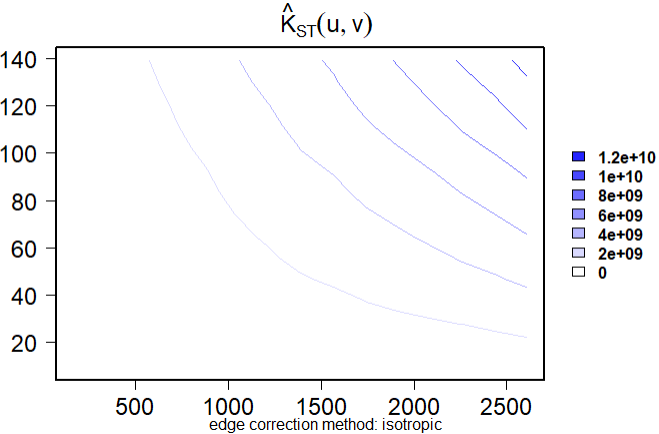
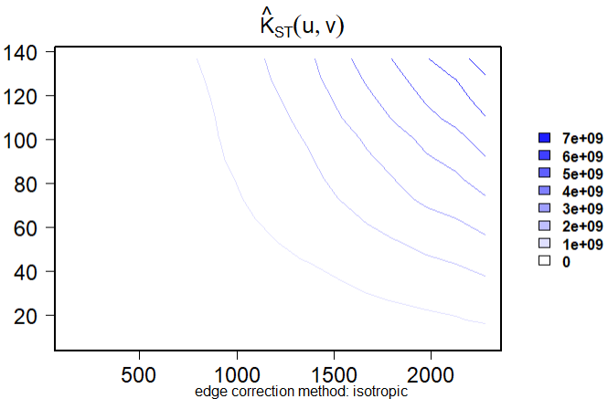
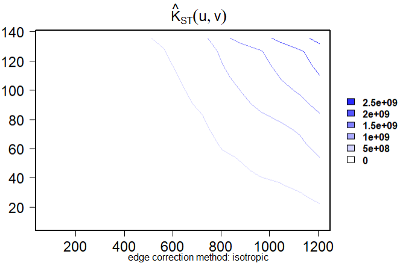
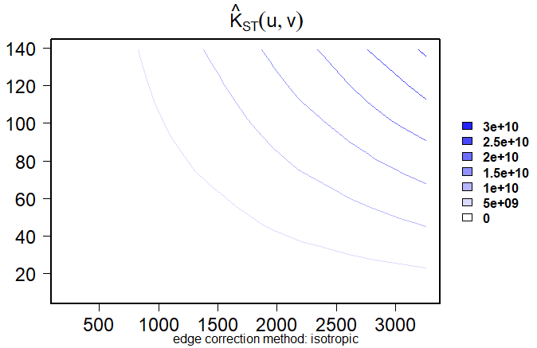
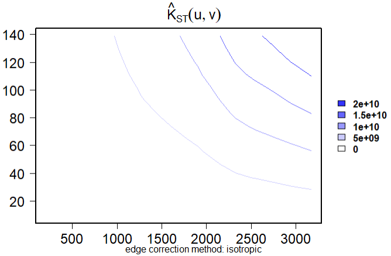

This project maps how four lifestyle sectors—fitness centres (SSIC 93111), adult apparel retail (47711), restaurants and cafés (56111), and event/concert organisers (82303)—shape Singapore’s urban rhythms from Jan 2024 to Jun 2025. We clean ACRA registrations, geocode via OneMap, and analyse spatial and spatio-temporal clustering with sf, tmap, and spatstat/stpp to reveal persistent hotspots and monthly pulses. The pipeline pinpoints where amenities concentrate around transit and commercial cores and where neighbourhood gaps remain. These signals guide land-use and management choices—from activating MRT-adjacent frontages to seeding daily-needs in undersupplied towns and calibrating event operations—toward vibrant, 15-minute living.

# 1 Loading the R packages

In this exercise, we will use following packages:

tidyverse – A collection of data science packages (readr, dplyr, tidyr, ggplot2, etc.) with a unified grammar for importing, wrangling, and visualising data.

sf – Simple Features for R: create, read, write, transform, and analyse vector geospatial data (points/lines/polygons) with modern CRS support.

tmap – Thematic mapping for R: produce high-quality static maps and interactive web maps (via leaflet) with flexible cartographic styling.

httr – Tools for working with HTTP: make GET/POST requests, handle authentication, and parse web API responses.

patchwork – Combine multiple ggplot2 plots into neat layouts (grids, annotations, shared titles) with simple operators.

terra – Modern spatial raster/vector handling: read/write, project, crop, mask, compute terrain analyses, and rasterize/vectorize operations.

spatstat – Comprehensive spatial point pattern analysis: create ppp objects, estimate G/F/K/L functions, fit point process models, KDE, simulation, and hypothesis tests.

rvest – Web scraping made easy: download HTML pages and extract elements, text, and tables with css/xpath selectors.

sparr - Spatial and spatio-temporal relative risk: estimate and compare densities between groups of point events, construct relative risk surfaces, and perform hypothesis testing for spatial clustering.

stpp - Spatio-temporal point pattern analysis: analyse events distributed in both space and time, providing tools for second-order characteristics, spatio-temporal K-functions, and kernel intensity estimation.

```{r}
pacman::p_load(tidyverse, sf, tmap, httr, dplyr, ggplot2, 
               patchwork, terra, spatstat, rvest, sparr, stpp)
```

# 2 Data Importing and Wrangling

## 2.1 Importing and saving ACRA data

The code below collects all ACRA CSV files from the specified folder, reads and combines them into a single dataset, and saves the result as an RDS file for later use.

```{r}
folder_path <- "data/aspatial/acra"
file_list <- list.files(path = folder_path,
                        pattern = "^ACRA*.*\\.csv$",
                        full.names = TRUE)

acra_data <- file_list %>%
  map_dfr(read_csv)

write_rds(acra_data,
          "data/rds/acra_data.rds")
```

## 2.2 Tidying ACRA data

Four types of business that related to Singaporean's lifestyle are selected:

SSIC 93111 – Fitness centres and gymnasiums

SSIC 47711 – Retail sale of clothing for adults

SSIC 56111 – Restaurants and Cafés

SSIC 82303 – Event/Concert Organisers

The code below extracts the selected business types from the ACRA dataset. For each category, it selects relevant variables, standardises the incorporation date into usable formats (year, month, abbreviation), pads postal codes to six digits for consistency, and filters businesses registered between January 1, 2024, and June 30, 2025. The result is four cleaned datasets, each tailored for subsequent spatial and temporal analysis.

```{r}
#Fitness centres and gymnasiums 
biz_93111 <- acra_data %>%
  select(1:24) %>%
  filter(primary_ssic_code == 93111) %>%
  rename(date = registration_incorporation_date) %>%
  mutate(date = as.Date(date),
         YEAR = year(date),
         MONTH_NUM = month(date),
         MONTH_ABBR = month(date,
                            label = TRUE,
                            abbr = TRUE)) %>%
  mutate(
    postal_code = str_pad(postal_code, 
    width = 6, side = "left", pad = "0")) %>% 
           filter(date >= as.Date("2024-01-01") & date <= as.Date("2025-06-30"))

#Retail sale of clothing for adults
biz_47711 <- acra_data %>%
  select(1:24) %>%
  filter(primary_ssic_code == 47711) %>%
  rename(date = registration_incorporation_date) %>%
  mutate(date = as.Date(date),
         YEAR = year(date),
         MONTH_NUM = month(date),
         MONTH_ABBR = month(date,
                            label = TRUE,
                            abbr = TRUE)) %>%
  mutate(
    postal_code = str_pad(postal_code, 
    width = 6, side = "left", pad = "0")) %>% 
           filter(date >= as.Date("2024-01-01") & date <= as.Date("2025-06-30"))

#Restaurants and Cafés
biz_56111 <- acra_data %>%
  select(1:24) %>%
  filter(primary_ssic_code == 56111) %>%
  rename(date = registration_incorporation_date) %>%
  mutate(date = as.Date(date),
         YEAR = year(date),
         MONTH_NUM = month(date),
         MONTH_ABBR = month(date,
                            label = TRUE,
                            abbr = TRUE)) %>%
  mutate(
    postal_code = str_pad(postal_code, 
    width = 6, side = "left", pad = "0")) %>% 
           filter(date >= as.Date("2024-01-01") & date <= as.Date("2025-06-30"))

#Event/Concert Organisers
biz_82303 <- acra_data %>%
  select(1:24) %>%
  filter(primary_ssic_code == 82303) %>%
  rename(date = registration_incorporation_date) %>%
  mutate(date = as.Date(date),
         YEAR = year(date),
         MONTH_NUM = month(date),
         MONTH_ABBR = month(date,
                            label = TRUE,
                            abbr = TRUE)) %>%
  mutate(
    postal_code = str_pad(postal_code, 
    width = 6, side = "left", pad = "0")) %>% 
           filter(date >= as.Date("2024-01-01") & date <= as.Date("2025-06-30"))
```

## 2.3 Geocoding

The code below performs geocoding for each business type using the SLA OneMap API. It first extracts unique postal codes from the dataset and queries the API to retrieve corresponding geographic coordinates and address details.

The results are separated into two groups: found (postal codes successfully matched) and not_found (unmatched codes). The matched geocode results are tidied and joined back into the business dataset, enriching each record with spatial information.

Finally, the updated dataset is saved as an .rds file, and an sf (Simple Features) object is created with EPSG:3414 projection, enabling spatial analysis and mapping of the businesses.

::: panel-tabset
### Fitness centres and gymnasiums

```{r}
#Geocoding
postcodes <- unique(biz_93111$postal_code)

url <- "https://onemap.gov.sg/api/common/elastic/search"

found <- data.frame()
not_found <- data.frame(postcode = character())

for (pc in postcodes) {
  query <- list(
    searchVal = pc,
    returnGeom = "Y",
    getAddrDetails = "Y",
    pageNum = "1"
  )

  res <- GET(url, query = query)
  json <- content(res)
  
  if (json$found != 0) {
    df <- as.data.frame(json$results, stringsAsFactors = FALSE)
    df$input_postcode <- pc
    found <- bind_rows(found, df)
  } else {
    not_found <- bind_rows(not_found, data.frame(postcode = pc))
  }
}

#Tidying the geocoded data
found <- found %>%
  select(1:10)

#Appending the location information
biz_93111 = biz_93111 %>%
  left_join(found,
            by = c('postal_code' = 'POSTAL'))

#Saving the data
write_rds(biz_93111, "data/rds/biz_93111.rds")

#Converting into SF data frame
biz_93111_sf <- st_as_sf(biz_93111,
                         coords = c("X", "Y"),
                         crs = 3414)
```

### Retail sale of clothing for adults

```{r}
#Geocoding
postcodes <- unique(biz_47711$postal_code)

url <- "https://onemap.gov.sg/api/common/elastic/search"

found <- data.frame()
not_found <- data.frame(postcode = character())

for (pc in postcodes) {
  query <- list(
    searchVal = pc,
    returnGeom = "Y",
    getAddrDetails = "Y",
    pageNum = "1"
  )

  res <- GET(url, query = query)
  json <- content(res)
  
  if (json$found != 0) {
    df <- as.data.frame(json$results, stringsAsFactors = FALSE)
    df$input_postcode <- pc
    found <- bind_rows(found, df)
  } else {
    not_found <- bind_rows(not_found, data.frame(postcode = pc))
  }
}

#Tidying the geocoded data
found <- found %>%
  select(1:10)

#Appending the location information
biz_47711 = biz_47711 %>%
  left_join(found,
            by = c('postal_code' = 'POSTAL'))

#Saving the data
write_rds(biz_47711, "data/rds/biz_47711.rds")

#Converting into SF data frame
biz_47711_sf <- st_as_sf(biz_47711,
                         coords = c("X", "Y"),
                         crs = 3414)
```

### Restaurants and Cafés

```{r}
#Geocoding
postcodes <- unique(biz_56111$postal_code)

url <- "https://onemap.gov.sg/api/common/elastic/search"

found <- data.frame()
not_found <- data.frame(postcode = character())

for (pc in postcodes) {
  query <- list(
    searchVal = pc,
    returnGeom = "Y",
    getAddrDetails = "Y",
    pageNum = "1"
  )

  res <- GET(url, query = query)
  json <- content(res)
  
  if (json$found != 0) {
    df <- as.data.frame(json$results, stringsAsFactors = FALSE)
    df$input_postcode <- pc
    found <- bind_rows(found, df)
  } else {
    not_found <- bind_rows(not_found, data.frame(postcode = pc))
  }
}

#Tidying the geocoded data
found <- found %>%
  select(1:10)

#Appending the location information
biz_56111 = biz_56111 %>%
  left_join(found,
            by = c('postal_code' = 'POSTAL'))

#Saving the data
write_rds(biz_56111, "data/rds/biz_56111.rds")

#Converting into SF data frame
biz_56111_sf <- st_as_sf(biz_56111,
                         coords = c("X", "Y"),
                         crs = 3414)
```

### Event/Concert Organisers

```{r}
#Geocoding
postcodes <- unique(biz_82303$postal_code)

url <- "https://onemap.gov.sg/api/common/elastic/search"

found <- data.frame()
not_found <- data.frame(postcode = character())

for (pc in postcodes) {
  query <- list(
    searchVal = pc,
    returnGeom = "Y",
    getAddrDetails = "Y",
    pageNum = "1"
  )

  res <- GET(url, query = query)
  json <- content(res)
  
  if (json$found != 0) {
    df <- as.data.frame(json$results, stringsAsFactors = FALSE)
    df$input_postcode <- pc
    found <- bind_rows(found, df)
  } else {
    not_found <- bind_rows(not_found, data.frame(postcode = pc))
  }
}

#Tidying the geocoded data
found <- found %>%
  select(1:10)

#Appending the location information
biz_82303 = biz_82303 %>%
  left_join(found,
            by = c('postal_code' = 'POSTAL'))

#Saving the data
write_rds(biz_82303, "data/rds/biz_82303.rds")

#Converting into SF data frame
biz_82303_sf <- st_as_sf(biz_82303,
                         coords = c("X", "Y"),
                         crs = 3414)
```
:::

## 2.4 Creating owin object

The code below processes Singapore’s Master Plan 2019 subzone boundaries for spatial analysis. It reads the KML file, extracts key attributes (region, planning area, subzone), removes irrelevant areas (Southern Group and offshore islands), and saves the cleaned dataset. Finally, it converts the boundaries into an owin object to define the study area for spatial point pattern analysis.

```{r}
mpsz_sf <- st_read("data/geospatial/MasterPlan2019SubzoneBoundaryNoSeaKML.kml") %>% 
  st_zm(drop = TRUE, what = "ZM") %>% st_transform(crs = 3414)

extract_kml_field <- function(html_text, field_name) {
  if (is.na(html_text) || html_text == "") return(NA_character_)
  
  page <- read_html(html_text)
  rows <- page %>% html_elements("tr")
  
  value <- rows %>%
    keep(~ html_text2(html_element(.x, "th")) == field_name) %>%
    html_element("td") %>%
    html_text2()
  
  if (length(value) == 0) NA_character_ else value
}

mpsz_sf <- mpsz_sf %>%
  mutate(
    REGION_N = map_chr(Description, extract_kml_field, "REGION_N"),
    PLN_AREA_N = map_chr(Description, extract_kml_field, "PLN_AREA_N"),
    SUBZONE_N = map_chr(Description, extract_kml_field, "SUBZONE_N"),
    SUBZONE_C = map_chr(Description, extract_kml_field, "SUBZONE_C")
  ) %>%
  select(-Name, -Description) %>%
  relocate(geometry, .after = last_col())

mpsz_cl <- mpsz_sf %>%
  filter(SUBZONE_N != "SOUTHERN GROUP",
         PLN_AREA_N != "WESTERN ISLANDS",
         PLN_AREA_N != "NORTH-EASTERN ISLANDS")

write_rds(mpsz_cl, 
          "data/rds/mpsz_cl.rds")

sg_owin <- as.owin(mpsz_cl)
```

## 2.5 Combining point events object and owin object

The code below prepares business location data for spatial point pattern analysis. It converts the geocoded business datasets (in sf format) into ppp objects required by the spatstat package. The rjitter() function slightly adjusts overlapping points to avoid duplication errors. Finally, each business type dataset is clipped to the Singapore study area (sg_owin) so that analyses are restricted within valid subzone boundaries.

```{r}
# Converting sf data frames to ppp class
biz_93111_ppp <- as.ppp(biz_93111_sf) %>%
  rjitter(retry = TRUE,
          nsim = 1,
          drop = TRUE)

biz_47711_ppp <- as.ppp(biz_47711_sf) %>%
  rjitter(retry = TRUE,
          nsim = 1,
          drop = TRUE)

biz_56111_ppp <- as.ppp(biz_56111_sf) %>%
  rjitter(retry = TRUE,
          nsim = 1,
          drop = TRUE)

biz_82303_ppp <- as.ppp(biz_82303_sf) %>%
  rjitter(retry = TRUE,
          nsim = 1,
          drop = TRUE)

# Combine
biz_93111_ppp = biz_93111_ppp[sg_owin]
biz_47711_ppp = biz_47711_ppp[sg_owin]
biz_56111_ppp = biz_56111_ppp[sg_owin]
biz_82303_ppp = biz_82303_ppp[sg_owin]
```

# 3 Business Overview

## Visualising the distribution

```{r fig.width=10, fig.height=6}
plot_monthly <- function(df, title_text, fill_color) {
  df %>%
    filter(date >= as.Date("2024-01-01") & date <= as.Date("2025-06-30")) %>%
    mutate(MonthYear = format(date, "%b %Y")) %>%
    mutate(MonthYear = factor(MonthYear, 
                              levels = format(seq(as.Date("2024-01-01"),
                                                  as.Date("2025-06-01"),
                                                  by = "1 month"), "%b %Y"),
                              ordered = TRUE)) %>%
    ggplot(aes(x = MonthYear)) +
    geom_bar(fill = fill_color) +   # use passed colour
    labs(
      title = title_text,
      x = "Month-Year",
      y = "Number of registrations"
    ) +
    ylim(0, 150) +
    theme_minimal() +
    theme(
      axis.text.x = element_text(angle = 45, hjust = 1),
      plot.title = element_text(hjust = 0.5, size = 13, face = "bold")
    )
}

# Assign unique colours
p1 <- plot_monthly(biz_93111, "Distribution of Fitness Centres and Gymnasiums", "#a6cee3")
p2 <- plot_monthly(biz_47711, "Distribution of Retail Sale of Clothing for Adults", "#fb9a99")
p3 <- plot_monthly(biz_56111, "Distribution of Restaurants and Cafés", "#b2df8a")
p4 <- plot_monthly(biz_82303, "Distribution of Event/Concert Organisers", "#fdbf6f")

# Combine 2×2
(p1 + p2) / (p3 + p4)
```

The registration trends of the four business types between January 2024 and June 2025 reveal distinct patterns.

Fitness Centres and Gymnasiums show relatively low and fluctuating registrations, with occasional peaks, suggesting niche but growing demand.

Retail Clothing Stores maintain a steady level of registrations across the period, reflecting stable consumer demand for fashion and apparel.

Restaurants and Cafés record the highest number of registrations, with clear peaks in early and mid-2024, indicating strong entrepreneurial activity and consistent demand in the food and beverage sector.

Event and Concert Organisers display moderate but slightly declining registrations over time, possibly influenced by market saturation or economic constraints on entertainment services.

Overall, the distribution highlights food services as the most vibrant and rapidly expanding sector, while retail clothing remains steady, fitness shows sporadic growth, and events demonstrate more cautious or stabilising entry into the market.

## Visualising the business

```{r}
tmap_mode("view")

tm_shape(biz_93111_sf) +
  tm_dots(col = "#1f78b4", size = 0.3, alpha = 0.7, id = "entity_name", legend.show = TRUE,
          group = "Fitness centres and gymnasiums") +
tm_shape(biz_47711_sf) +
  tm_dots(col = "#e31a1c", size = 0.3, alpha = 0.7, id = "entity_name", legend.show = TRUE,
          group = "Retail sale of clothing for adults") +
tm_shape(biz_56111_sf) +
  tm_dots(col = "#33a02c", size = 0.3, alpha = 0.7, id = "entity_name", legend.show = TRUE,
          group = "Restaurants and Cafés") +
tm_shape(biz_82303_sf) +
  tm_dots(col = "#ff7f00", size = 0.3, alpha = 0.7, id = "entity_name", legend.show = TRUE,
          group = "Event/Concert Organisers") +
tm_layout(legend.outside = TRUE,
          legend.title.size = 1.2,
          legend.text.size = 0.9) +
tm_view(set_zoom_limits = c(12,16))
```

The spatial distribution of the four business types reveals clear urban concentration patterns in Singapore.

Fitness Centres and Gymnasiums (blue dots) are fairly dispersed but cluster in residential towns, reflecting demand for convenient access to health and fitness services.

Retail Clothing Stores (red dots) are more heavily concentrated in central areas, particularly the downtown core and major commercial hubs, where shopping malls dominate.

Restaurants and Cafés (green dots) appear densely concentrated in the central and eastern regions, aligning with lifestyle clusters and dining districts, while still maintaining a widespread presence across neighborhoods.

Event and Concert Organisers (orange dots) are concentrated in the city centre and selected regional nodes, close to major venues and transport links.

Overall, the distribution highlights Singapore’s mixed pattern of decentralised services for daily needs, such as gyms and dining, alongside a strong centralisation of lifestyle retail and event businesses in key urban and commercial cores.

# 4 Analysis of Fitness centres and gymnasiums

::: panel-tabset
## Choropleth Map

```{r}
# Count number of businesses in each subzone
biz_count_93111 <- biz_93111_sf %>%
  st_join(mpsz_cl, join = st_within) %>%   
  st_drop_geometry() %>%
  group_by(SUBZONE_N) %>%
  summarise(count = n())                   

# Join count back to subzone polygons
mpsz_biz93111 <- mpsz_cl %>%
  left_join(biz_count_93111, by = "SUBZONE_N")

# Identify outliers by boxplot rule
stats_cnt    <- boxplot.stats(mpsz_biz93111$count)
outlier_vals <- stats_cnt$out
outlier_sf   <- mpsz_biz93111 %>% filter(count %in% outlier_vals)
outlier_lbl <- st_point_on_surface(outlier_sf)

# Plot
tmap_mode("plot")

tm_shape(mpsz_biz93111) + 
  tm_polygons(fill = "count", 
              fill.scale = tm_scale_intervals(
                style = "quantile", 
                n = 4,
                values = "brewer.blues"), 
              fill.legend = tm_legend(
                title = "Count"),
              fill.chart = tm_chart_box()) +
  tm_borders(fill_alpha = 0.5) +
  tm_shape(outlier_sf) +
    tm_borders(col = "#000000", lwd = 2) +
  tm_shape(outlier_lbl) +
  tm_compass(type="8star", size = 2) +
  tm_layout(main.title = "Distribution of Fitness Centres & Gymnasiums by Subzone")
```

## Outlier List

```{r}
# Extract outlier zones with counts and their regions, sort in descending order
outlier_zones_sorted <- outlier_sf %>%
  st_drop_geometry() %>%
  arrange(desc(count)) %>%
  select(SUBZONE_N, REGION_N, count)

# List
print(outlier_zones_sorted)
```
:::

The choropleth map shows the distribution of fitness centres and gymnasiums across Singapore subzones. Most subzones host only 1–4 establishments, represented in lighter blue, indicating limited accessibility in many areas.

However, several subzones outlined in black stand out as outliers, with counts well above the overall pattern. Notably, Cecil (22), Geylang East (14), Chinatown (13), Katong (12), and Sentosa (11) record the highest concentrations. These subzones, mainly within the Central Region, are closely linked to commercial districts, lifestyle hubs, and tourist destinations, where demand for fitness services is strongest.

The map highlights spatial inequality, with fitness centres clustering in central and eastern urban subzones while peripheral areas remain underserved. This suggests opportunities for expanding services to improve accessibility in less well-covered regions.

## 4.1 First-order Spatial Point Patterns Analysis

### 4.1.1 Clark-Evans test with CSR

The test hypotheses are:

Ho = The distribution of Fitness centres and gymnasiums are randomly distributed.

H1= The distribution of Fitness centres and gymnasiums are not randomly distributed.

The 95% confident interval will be used.

```{r}
clarkevans.test(biz_93111_ppp,
                correction="none",
                clipregion="sg_owin",
                alternative=c("clustered"),
                method="MonteCarlo",
                nsim=99)
```

Since p\<0.05, we reject the null hypothesis (H0), and conclude that the distribution of Fitness centres and gymnasiums is significantly clustered.

### 4.1.2 Kernel Density Estimation Method

bw.ppl() algorithm is used as it tends to produce the more appropriate values when the pattern consists predominantly of tight clusters.

```{r}
# convert into km
biz_93111_ppp_km <- rescale.ppp(
  biz_93111_ppp, 1000, "km")

kde_biz_93111_km <- density(biz_93111_ppp_km,
                              sigma=bw.ppl,
                              edge=TRUE,
                              kernel="gaussian")

# Convert into raster
kde_93111_bw_terra <- rast(kde_biz_93111_km)

# Assign projection systems
crs(kde_93111_bw_terra) <- "EPSG:3414"

kde_93111_bw_terra
```

```{r}
tmap_mode('plot')

tm_shape(kde_93111_bw_terra) + 
  tm_raster(col.scale = 
              tm_scale_continuous(
                values = "viridis"),
            col.legend = tm_legend(
            title = "Density values",
            title.size = 0.7,
            text.size = 0.7,
            bg.color = "white",
            bg.alpha = 0.7,
            position = tm_pos_in(
              "right", "bottom"),
            frame = TRUE)) +
  tm_graticules(labels.size = 0.7) +
  tm_compass() +
  tm_layout(main.title = "KDE of Fitness Centres and Gymnasiums",
            scale = 1.0)
```

The KDE map of fitness centres and gymnasiums shows clear clustering in Singapore. The most intense hotspot is in the central-southern area, reflecting strong concentration in lifestyle and commercial hubs. Smaller clusters appear in the east and north, while western and peripheral zones show low density, indicating limited accessibility.

Overall, fitness centres and gymnasiums are not evenly spread but tend to group in key urban and commercial centres, leaving other subzones relatively underserved. This reflects urban lifestyle demand and spatial inequalities in service distribution.

## 4.2 Regional analysis - Central Region

```{r}
cr <- mpsz_cl %>%
  filter(REGION_N == "CENTRAL REGION")

cr_owin = as.owin(cr)

biz93111_cr_ppp = biz_93111_ppp[cr_owin]
biz93111_cr_ppp.km = rescale.ppp(biz93111_cr_ppp, 1000, "km")

plot(unmark(biz93111_cr_ppp.km), 
  main="Fitness centres and gymnasiums in Central Region")
```

The map shows the spatial distribution of fitness centres and gymnasiums in the Central Region of Singapore, with notable clustering in the downtown and surrounding urban areas.

### 4.2.1 Central Region

#### 4.2.1.1 Second-order Spatial Point Patterns Analysis

For complete spatial randomness test, the hypothesis and test are as follows:

Ho = The distribution of Fitness centres and gymnasiums in Central Region are randomly distributed.

H1= The distribution of Fitness centres and gymnasiums in Central Region are not randomly distributed.

The null hypothesis will be rejected if p-value is smaller than alpha value of 0.001.

```{r}
L_93111_cr.csr <- envelope(biz93111_cr_ppp, Lest,
                        nsim = 99, rank = 1, glocal = TRUE)
plot(L_93111_cr.csr, . - r ~ r,
     main = "L-function (Fitness centres in Central Region)",
     xlab = "d (m)", ylab = "L(d) - r", xlim=c(0,1000))
```

The observed curve (black line) lies well above the theoretical expectation (red dashed line) and consistently exceeds the grey simulation envelope, indicating strong deviation from complete spatial randomness. Clustering begins almost immediately at short distances of less than 100 metres and persists across the entire range up to 1000 metres. This pattern shows that fitness centres are not evenly spread but instead concentrate in close proximity, forming spatial hotspots. Such clustering suggests that businesses tend to locate near established hubs.

Since the observed values fall outside the CSR envelope at nearly all distances, the null hypothesis of random distribution is rejected. Therefore, fitness centres in the Central Region exhibit statistically significant clustering across both small and larger spatial scales.

#### 4.2.1.2 Spatio-Temporal Point Patterns Analysis

```{r}
# Make geometries valid and align CRS
biz_93111_sf <- st_make_valid(biz_93111_sf)
mpsz_cl      <- st_make_valid(mpsz_cl)

if (st_crs(biz_93111_sf) != st_crs(mpsz_cl)) {
  biz_93111_sf <- st_transform(biz_93111_sf, st_crs(mpsz_cl))
}

# Central Region polygons
mpsz_cr <- mpsz_cl %>%
  filter(grepl("^central\\s*region$", REGION_N, ignore.case = TRUE))

stopifnot(nrow(mpsz_cr) > 0)   # sanity check

# Points that intersect Central Region
biz_93111_cr <- biz_93111_sf %>%
  st_join(mpsz_cr %>% select(REGION_N), join = st_intersects, left = FALSE)

if (nrow(biz_93111_cr) == 0) {
  biz_93111_cr <- biz_93111_sf %>%
    st_buffer(0.5) %>%                                    # ~0.5 m in EPSG:3414
    st_join(mpsz_cr %>% select(REGION_N),
            join = st_intersects, left = FALSE)
}

stopifnot(nrow(biz_93111_cr) > 0)   # prevent sfc[[1]] error

# Filter to Jan 2024 – Jun 2025 and build Year-Month facet
biz_93111_cr <- biz_93111_cr %>%
  filter(date >= as.Date("2024-01-01") & date <= as.Date("2025-06-30")) %>%
  mutate(YearMonth = format(date, "%b %Y"),
         YearMonth = factor(YearMonth,
                            levels = format(seq(as.Date("2024-01-01"),
                                                as.Date("2025-06-01"),
                                                by = "1 month"), "%b %Y"),
                            ordered = TRUE))

# Plot
tmap_mode("plot")

tm_shape(mpsz_cr) +
  tm_polygons(fill = "grey90") +
  tm_borders(col = "grey60") +
tm_shape(biz_93111_cr) +
  tm_dots(size = 0.06) +
tm_facets(by = "YearMonth", ncol = 6, nrow = 3, free.coords = FALSE, drop.units = TRUE) +
tm_title("Fitness centres and gymnasiums in Central Region by Month")
```

The faceted map shows the monthly distribution of new fitness centres and gymnasiums registered in Singapore’s Central Region from January 2024 to June 2025. Registrations were sparse in early 2024 but began to rise notably from mid-2024, peaking between July and October, before stabilising into 2025.

Spatially, most businesses are clustered in core areas, reflecting the concentration of office workers, residents, and lifestyle demand. Outer subzones saw fewer new establishments, highlighting the urban-centric growth of the sector.

##### STKDE by Month

```{r}
start_date <- as.Date("2024-01-01")
end_date   <- as.Date("2025-06-30")

biz_93111_cr18 <- biz_93111_cr %>%
  filter(date >= start_date, date <= end_date) %>%
  mutate(MonthIndex = (year(date) - 2024) * 12 + month(date)) %>%   # Jan-2024 -> 1
  mutate(MonthIndex = MonthIndex - (min(MonthIndex) - 1))           # renumber to 1..18

stopifnot(all(range(biz_93111_cr18$MonthIndex) == c(1, 18)))

cr_win  <- as.owin(mpsz_cr)
xy      <- st_coordinates(biz_93111_cr18)

cr_ppp <- ppp(
  x = xy[,1], y = xy[,2],
  window = cr_win,
  marks  = data.frame(m = biz_93111_cr18$MonthIndex)  
)


cr_ppp <- rjitter(cr_ppp, retry = TRUE, nsim = 1, drop = TRUE)
cr_ppp_win <- cr_ppp[cr_win]

set.seed(1234)
BOOT.spattemp(cr_ppp_win) 
```

```{r}
h_spat   <- 704
lambda_t <- 6.8


m_vec    <- if (is.data.frame(marks(cr_ppp))) marks(cr_ppp)[[1]] else as.integer(marks(cr_ppp))
t_range  <- range(m_vec, na.rm = TRUE)

tab_m        <- tabulate(m_vec, nbins = 18)
first_nonemp <- which(tab_m > 0)[1]

st_first <- spattemp.density(
  cr_ppp[m_vec == first_nonemp],
  h      = h_spat,
  lambda = lambda_t,
  tlim   = t_range
)

im_first   <- st_first$spatial
r_template <- rast(im_first) |> mask(vect(mpsz_cr))

r_list <- vector("list", 18)

for (i in 1:18) {
  if (any(m_vec == i)) {
    st_i <- spattemp.density(
      cr_ppp[m_vec == i],
      h      = h_spat,
      lambda = lambda_t,
      tlim   = t_range
    )
    im_i <- st_i$spatial
    r_i  <- rast(im_i)
  } else {
    r_i <- r_template
    values(r_i) <- 0
  }
  
  r_i <- resample(r_i, r_template, method = "bilinear") |>
         mask(vect(mpsz_cr))
  
  names(r_i) <- paste0("Month_", sprintf("%02d", i))
  r_list[[i]] <- r_i
}

kde_stack <- do.call(c, r_list)
crs(kde_stack) <- st_crs(mpsz_cr)$wkt


rng <- range(values(kde_stack), na.rm = TRUE)
tmap_mode("plot")

map_facets <-
  tm_shape(kde_stack) +
    tm_raster(
      col.scale  = tm_scale_continuous(values = "viridis", limits = rng),
      col.legend = tm_legend(show = FALSE)
    ) +
    tm_borders(col = "grey40", lwd = 0.4) +
    tm_facets(nrow = 3, ncol = 6, free.coords = FALSE, drop.units = TRUE) +
    tm_layout(main.title = "Monthly KDE of Analysis of Fitness centres and gymnasiums – Central Region")

legend_panel <-
  tm_shape(kde_stack[[1]]) +
    tm_raster(
      col.scale  = tm_scale_continuous(values = "viridis", limits = rng),
      col.legend = tm_legend(title = "Density values")
    ) +
    tm_layout(legend.only = TRUE)

tmap_arrange(map_facets, legend_panel, ncol = 2, widths = c(6, 1))
```

The monthly KDE maps for fitness centres and gymnasiums in the Central Region reveal a persistent clustering pattern anchored in the downtown–city fringe area. This hotspot remains stable throughout the 18 months, reflecting the concentration of fitness businesses near commercial hubs, transport interchanges, and high-density office or retail zones. A secondary but weaker concentration appears in the eastern part of the region, while the western and peripheral areas remain consistently sparse.

Rather than shifting spatially, the intensity of clustering fluctuates over time. Stronger peaks are observed around mid-2024 and again in early 2025, suggesting bursts of new openings or registrations within established catchments. These fluctuations indicate that fitness centres continue to favor core urban locations with steady demand, while short-term surges in activity are likely linked to market cycles or seasonality.

##### K-function

```{r}
cr93111_coords <- st_coordinates(biz_93111_cr)

cr93111_df <- data.frame(
  x = cr93111_coords[, 1],  
  y = cr93111_coords[, 2],
  t = biz_93111_cr$`date`)

cr93111_stpp <- as.3dpoints(cr93111_df)
cr93111_stik <- STIKhat(cr93111_stpp)

plotK(cr93111_stik)
```



The plot shows high contour values at short spatial and temporal distances, indicating strong clustering of fitness centres and gymnasiums close together in both space and time. As distance and time increase, the contours flatten, suggesting weaker clustering or more random patterns. This means new establishments tend to open near existing ones within similar time periods, reflecting demand-driven clustering in central hotspots.

# 5 Analysis of Retail sale of clothing for adults

::: panel-tabset
## Choropleth Map

```{r}
# Count number of businesses in each subzone
biz_count_47711 <- biz_47711_sf %>%
  st_join(mpsz_cl, join = st_within) %>%   
  st_drop_geometry() %>%
  group_by(SUBZONE_N) %>%
  summarise(count = n())     

# Join count back to subzone polygons
mpsz_biz47711 <- mpsz_cl %>%
  left_join(biz_count_47711, by = "SUBZONE_N")

# Identify outliers by boxplot rule
stats_cnt    <- boxplot.stats(mpsz_biz47711$count)
outlier_vals <- stats_cnt$out
outlier_sf   <- mpsz_biz47711 %>% filter(count %in% outlier_vals)
outlier_lbl <- st_point_on_surface(outlier_sf)

# Plot
tmap_mode("plot")

tm_shape(mpsz_biz47711) + 
  tm_polygons(fill = "count", 
              fill.scale = tm_scale_intervals(
                style = "quantile", 
                n = 4,
                values = "brewer.reds"), 
              fill.legend = tm_legend(
                title = "Count"),
              fill.chart = tm_chart_box()) +
  tm_borders(fill_alpha = 0.5) +
  tm_shape(outlier_sf) +
    tm_borders(col = "#000000", lwd = 2) +
  tm_shape(outlier_lbl) +
  tm_compass(type="8star", size = 2) +
  tm_layout(main.title = "Distribution of Retail sale of clothing for adults")
```

## Outlier List

```{r}
# Extract outlier zones with counts and their regions, sort in descending order
outlier_zones_sorted <- outlier_sf %>%
  st_drop_geometry() %>%
  arrange(desc(count)) %>%
  select(SUBZONE_N, REGION_N, count)

# List
print(outlier_zones_sorted)
```
:::

The choropleth map depicts the distribution of adult clothing retail outlets across Singapore subzones. Most subzones host only 1–5 outlets, reflected by the lighter shades of red.

However, several subzones highlighted with thick black borders emerge as outliers, with Geylang East (51 outlets) standing out as the largest cluster. Other significant hotspots include Woodlands East (21), Cecil (17), Tampines East (17), Upper Thomson (17), and City Hall (15). These subzones correspond to major commercial hubs, shopping districts, and densely populated town centres across the Central, East, and North Regions.

The concentration of clothing retailers in these areas reflects their role as shopping belts and transport-linked nodes with high consumer traffic. In contrast, peripheral subzones and industrial estates show little to no activity, underscoring spatial inequality in retail access.

Overall, the distribution highlights a few dominant retail hubs while revealing underserved regions with limited fashion retail presence.

## 5.1 First-order Spatial Point Patterns Analysis

### 5.1.1 Clark-Evans test with CSR

The test hypotheses are:

Ho = The distribution of Retail sale of clothing for adults are randomly distributed.

H1= The distribution of Retail sale of clothing for adults are not randomly distributed.

The 95% confident interval will be used.

```{r}
clarkevans.test(biz_47711_ppp,
                correction="none",
                clipregion="sg_owin",
                alternative=c("clustered"),
                method="MonteCarlo",
                nsim=99)
```

Since p\<0.05, we reject the null hypothesis (H0), and conclude that the distribution of Retail sale of clothing for adults is significantly clustered.

### 5.1.2 Kernel Density Estimation Method

bw.ppl() algorithm is used as it tends to produce the more appropriate values when the pattern consists predominantly of tight clusters.

```{r}
# convert into km
biz_47711_ppp_km <- rescale.ppp(
  biz_47711_ppp, 1000, "km")

kde_biz_47711_km <- density(biz_47711_ppp_km,
                              sigma=bw.ppl,
                              edge=TRUE,
                              kernel="gaussian")

# Convert into raster
kde_47711_bw_terra <- rast(kde_biz_47711_km)

# Assign projection systems
crs(kde_47711_bw_terra) <- "EPSG:3414"

kde_47711_bw_terra
```

```{r}
tmap_mode('plot')

tm_shape(kde_47711_bw_terra) + 
  tm_raster(col.scale = 
              tm_scale_continuous(
                values = "viridis"),
            col.legend = tm_legend(
            title = "Density values",
            title.size = 0.7,
            text.size = 0.7,
            bg.color = "white",
            bg.alpha = 0.7,
            position = tm_pos_in(
              "right", "bottom"),
            frame = TRUE)) +
  tm_graticules(labels.size = 0.7) +
  tm_compass() +
  tm_layout(main.title = "KDE of Retail sale of clothing for adults",
            scale = 1.0)
```

The KDE map of retail sale of clothing for adults shows strong clustering across Singapore. The most intense hotspot is concentrated in the central-southern area, reflecting the dominance of major shopping districts and malls in the city core. Additional moderate clusters can be observed in the eastern and northern regions, where regional centres also attract retail activity. By contrast, the western and peripheral areas display much lower density, suggesting limited presence of clothing retail outlets outside major commercial hubs.

Overall, retail clothing stores are unevenly distributed, with higher concentrations in urban centres and key shopping corridors. This pattern highlights consumer demand for accessible retail in central and regional hubs, while also revealing gaps in suburban and peripheral areas where such services remain less available.

## 5.2 Regional analysis- Central Region, East Region and North Region

```{r fig.width=12, fig.height=4}
par(mfrow = c(1, 3))

# Central Region
cr <- mpsz_cl %>%
  filter(REGION_N == "CENTRAL REGION")

cr_owin = as.owin(cr)

biz47711_cr_ppp = biz_47711_ppp[cr_owin] 
biz47711_cr_ppp.km = rescale.ppp(biz47711_cr_ppp, 1000, "km")

plot(unmark(biz47711_cr_ppp.km), 
  main="Retail sale of clothing in Central Region")

# East Region
er <- mpsz_cl %>%
  filter(REGION_N == "EAST REGION")

er_owin = as.owin(er)

biz47711_er_ppp = biz_47711_ppp[er_owin]
biz47711_er_ppp.km = rescale.ppp(biz47711_er_ppp, 1000, "km")

plot(unmark(biz47711_er_ppp.km), 
  main="Retail sale of clothing in East Region")

# North Region
nr <- mpsz_cl %>%
  filter(REGION_N == "NORTH REGION")

nr_owin = as.owin(nr)

biz47711_nr_ppp = biz_47711_ppp[nr_owin]
biz47711_nr_ppp.km = rescale.ppp(biz47711_nr_ppp, 1000, "km")

plot(unmark(biz47711_nr_ppp.km), 
  main="Retail sale of clothing in North Region")
```

The maps show the distribution of retail clothing outlets across regions. In the Central Region, outlets are highly concentrated in core urban hubs, particularly around commercial districts. The East Region displays a moderate spread, with clusters around major town centers. The North Region shows fewer outlets overall, with businesses mainly concentrated near residential hubs, indicating lower retail density compared to the Central and East regions.

### 5.2.1 Central Region Second-order Spatial Point Patterns Analysis

#### 5.2.1.1 Second-order Spatial Point Patterns Analysis

For complete spatial randomness test, the hypothesis and test are as follows:

Ho = The distribution of Retail sale of clothing for adults in Central Region are randomly distributed.

H1= The distribution of Retail sale of clothing for adults in Central Region are not randomly distributed.

The null hypothesis will be rejected if p-value is smaller than alpha value of 0.001.

```{r}
L_47711_cr.csr <- envelope(biz47711_cr_ppp, Lest,
                        nsim = 99, rank = 1, glocal = TRUE)
plot(L_47711_cr.csr, . - r ~ r,
     main = "L-function (Retail sale of clothing in Central Region)",
     xlab = "d (m)", ylab = "L(d) - r", xlim=c(0,1000))
```

The observed curve (black line) rises steeply above the theoretical expectation (red dashed line) and quickly exceeds the grey simulation envelope, indicating strong deviation from complete spatial randomness. Clustering begins almost immediately, at distances under 100 metres, and remains significant across the entire range up to 1000 metres. This suggests that retail clothing outlets are located very close to one another, forming dense commercial clusters rather than being evenly distributed. The sharp rise at short distances highlights intense clustering in core shopping zones, while the sustained elevation across longer distances reflects broader regional hubs.

Since the observed values consistently fall outside the CSR envelope, the null hypothesis is rejected. Therefore, retail clothing outlets in the Central Region are not randomly distributed but significantly clustered across multiple spatial scales.

#### 5.2.1.2 Spatio-Temporal Point Patterns Analysis

```{r}
# Make geometries valid and align CRS
biz_47711_sf <- st_make_valid(biz_47711_sf)
mpsz_cl      <- st_make_valid(mpsz_cl)

if (st_crs(biz_47711_sf) != st_crs(mpsz_cl)) {
  biz_47711_sf <- st_transform(biz_47711_sf, st_crs(mpsz_cl))
}

# Central Region polygons
mpsz_cr <- mpsz_cl %>%
  filter(grepl("^central\\s*region$", REGION_N, ignore.case = TRUE))

stopifnot(nrow(mpsz_cr) > 0)   # sanity check

# Points that intersect Central Region
biz_47711_cr <- biz_47711_sf %>%
  st_join(mpsz_cr %>% select(REGION_N), join = st_intersects, left = FALSE)

if (nrow(biz_47711_cr) == 0) {
  biz_47711_cr <- biz_47711_sf %>%
    st_buffer(0.5) %>%                                    # ~0.5 m in EPSG:3414
    st_join(mpsz_cr %>% select(REGION_N),
            join = st_intersects, left = FALSE)
}

stopifnot(nrow(biz_47711_cr) > 0)   # prevent sfc[[1]] error

# Filter to Jan 2024 – Jun 2025 and build Year-Month facet
biz_47711_cr <- biz_47711_cr %>%
  filter(date >= as.Date("2024-01-01") & date <= as.Date("2025-06-30")) %>%
  mutate(YearMonth = format(date, "%b %Y"),
         YearMonth = factor(YearMonth,
                            levels = format(seq(as.Date("2024-01-01"),
                                                as.Date("2025-06-01"),
                                                by = "1 month"), "%b %Y"),
                            ordered = TRUE))

# Plot
tmap_mode("plot")

tm_shape(mpsz_cr) +
  tm_polygons(fill = "grey90") +
  tm_borders(col = "grey60") +
tm_shape(biz_47711_cr) +
  tm_dots(size = 0.06) +
tm_facets(by = "YearMonth", ncol = 6, nrow = 3, free.coords = FALSE, drop.units = TRUE) +
tm_title("Retail sale of clothing for adults in Central Region by Month")
```

The plot illustrates the monthly distribution of retail clothing businesses from January 2024 to June 2025 in the Central Region. The pattern shows consistent clustering of new business registrations across the months, with noticeable concentrations in the core urban zones.

While the density varies slightly month to month, the general trend highlights sustained growth and stability in demand for adult clothing retail outlets. Peaks appear in certain months, such as March, September, and early 2025, suggesting seasonal or fashion-driven cycles that influence registrations. The relatively even spread across the Central Region indicates the area remains an attractive hub for retail business activity.

Overall, the data suggests stable but strategically concentrated growth in adult clothing retail businesses.

##### STKDE by Month

```{r}
start_date <- as.Date("2024-01-01")
end_date   <- as.Date("2025-06-30")

biz_47711_cr18 <- biz_47711_cr %>%
  filter(date >= start_date, date <= end_date) %>%
  mutate(MonthIndex = (year(date) - 2024) * 12 + month(date)) %>%   
  mutate(MonthIndex = MonthIndex - (min(MonthIndex) - 1))           

stopifnot(all(range(biz_47711_cr18$MonthIndex) == c(1, 18)))

cr_win  <- as.owin(mpsz_cr)
xy      <- st_coordinates(biz_47711_cr18)

cr_ppp <- ppp(
  x = xy[,1], y = xy[,2],
  window = cr_win,
  marks  = data.frame(m = biz_47711_cr18$MonthIndex)  
)


cr_ppp <- rjitter(cr_ppp, retry = TRUE, nsim = 1, drop = TRUE)
cr_ppp_win <- cr_ppp[cr_win]

set.seed(1234)
BOOT.spattemp(cr_ppp_win) 
```

```{r}
h_spat   <- 770   
lambda_t <- 6.2


m_vec    <- if (is.data.frame(marks(cr_ppp))) marks(cr_ppp)[[1]] else as.integer(marks(cr_ppp))
t_range  <- range(m_vec, na.rm = TRUE)

tab_m        <- tabulate(m_vec, nbins = 18)
first_nonemp <- which(tab_m > 0)[1]

st_first <- spattemp.density(
  cr_ppp[m_vec == first_nonemp],
  h      = h_spat,
  lambda = lambda_t,
  tlim   = t_range
)

im_first   <- st_first$spatial
r_template <- rast(im_first) |> mask(vect(mpsz_cr))

r_list <- vector("list", 18)

for (i in 1:18) {
  if (any(m_vec == i)) {
    st_i <- spattemp.density(
      cr_ppp[m_vec == i],
      h      = h_spat,
      lambda = lambda_t,
      tlim   = t_range
    )
    im_i <- st_i$spatial
    r_i  <- rast(im_i)
  } else {
    r_i <- r_template
    values(r_i) <- 0
  }
  
  r_i <- resample(r_i, r_template, method = "bilinear") |>
         mask(vect(mpsz_cr))
  
  names(r_i) <- paste0("Month_", sprintf("%02d", i))
  r_list[[i]] <- r_i
}

kde_stack <- do.call(c, r_list)
crs(kde_stack) <- st_crs(mpsz_cr)$wkt


rng <- range(values(kde_stack), na.rm = TRUE)
tmap_mode("plot")

map_facets <-
  tm_shape(kde_stack) +
    tm_raster(
      col.scale  = tm_scale_continuous(values = "viridis", limits = rng),
      col.legend = tm_legend(show = FALSE)
    ) +
    tm_borders(col = "grey40", lwd = 0.4) +
    tm_facets(nrow = 3, ncol = 6, free.coords = FALSE, drop.units = TRUE) +
    tm_layout(main.title = "Monthly KDE of Retail sale of clothing for adults – Central Region")

legend_panel <-
  tm_shape(kde_stack[[1]]) +
    tm_raster(
      col.scale  = tm_scale_continuous(values = "viridis", limits = rng),
      col.legend = tm_legend(title = "Density values")
    ) +
    tm_layout(legend.only = TRUE)

tmap_arrange(map_facets, legend_panel, ncol = 2, widths = c(6, 1))
```

The KDE plots for retail sale of clothing in the Central Region from Jan 2024 to Jun 2025 reveal clear spatial clustering. Strong peaks emerge consistently in the core areas, with higher intensities observed around Aug–Sep 2024 and again in Feb–Mar 2025, suggesting possible seasonal or market-driven cycles. The clusters remain relatively stable across most months, though their intensity fluctuates, reflecting periods of stronger retail activity. Peripheral parts of the region remain sparse, reinforcing the concentration of retail clothing outlets in central urban spaces.

Compared with the point distribution maps, the KDE highlights clearer hotspot formation, showing how stores cluster tightly rather than dispersing evenly. This pattern indicates that retail clothing outlets favor concentrated locations with high customer flow, and the temporal peaks suggest that demand cycles strongly influence spatial intensity. Overall, the plots show that while the distribution is persistent, the level of clustering intensifies periodically, reflecting changing consumer and retail dynamics.

##### K-function

```{r}
cr47711_coords <- st_coordinates(biz_47711_cr)

cr47711_df <- data.frame(
  x = cr47711_coords[, 1],  
  y = cr47711_coords[, 2],
  t = biz_47711_cr$`date`)

cr47711_stpp <- as.3dpoints(cr47711_df)
cr47711_stik <- STIKhat(cr47711_stpp)

plotK(cr47711_stik)
```



The plot shows strong clustering of events at short spatial and temporal distances, meaning activities occur close together in both space and time. As distance and time increase, clustering weakens and distribution becomes more dispersed. This indicates businesses or events tend to concentrate locally within shorter periods, rather than being randomly spread across space and time.

### 5.2.2 East Region Second-order Spatial Point Patterns Analysis

#### 5.2.2.1 Second-order Spatial Point Patterns Analysis

For complete spatial randomness test, the hypothesis and test are as follows:

Ho = The distribution of Retail sale of clothing for adults in East Region are randomly distributed.

H1= The distribution of Retail sale of clothing for adults in East Region are not randomly distributed.

The null hypothesis will be rejected if p-value is smaller than alpha value of 0.001.

```{r}
L_47711_er.csr <- envelope(biz47711_er_ppp, Lest,
                        nsim = 99, rank = 1, glocal = TRUE)
plot(L_47711_er.csr, . - r ~ r,
     main = "L-function (Retail sale of clothing in East Region)",
     xlab = "d (m)", ylab = "L(d) - r", xlim=c(0,1000))
```

The L-function plot for retail clothing stores in the East Region shows that clustering begins to emerge at very short distances, around 50–100 meters, as the observed curve (black line) rises steeply above the theoretical expectation (red dashed line). This indicates that outlets are often located close to each other rather than being randomly spread. The separation between the observed and theoretical lines continues to widen beyond 200 meters and remains consistently above the simulation envelope (grey band) across the 1,000-meter range, confirming sustained clustering at multiple scales.

The strong and early deviation suggests that retail stores in the East Region concentrate heavily in specific commercial hubs, forming dense clusters rather than dispersing evenly. Thus, the null hypothesis is rejected, confirming that retail clothing outlets in this region are significantly clustered rather than randomly distributed.

#### 5.2.2.2 Spatio-Temporal Point Patterns Analysis

```{r}
# Make geometries valid and align CRS
biz_47711_sf <- st_make_valid(biz_47711_sf)
mpsz_cl      <- st_make_valid(mpsz_cl)

if (st_crs(biz_47711_sf) != st_crs(mpsz_cl)) {
  biz_47711_sf <- st_transform(biz_47711_sf, st_crs(mpsz_cl))
}

# Central Region polygons
mpsz_er <- mpsz_cl %>%
  filter(grepl("^east\\s*region$", REGION_N, ignore.case = TRUE))

stopifnot(nrow(mpsz_er) > 0)   # sanity check

# Points that intersect Central Region
biz_47711_er <- biz_47711_sf %>%
  st_join(mpsz_er %>% select(REGION_N), join = st_intersects, left = FALSE)

if (nrow(biz_47711_er) == 0) {
  biz_47711_er <- biz_47711_sf %>%
    st_buffer(0.5) %>%                                    # ~0.5 m in EPSG:3414
    st_join(mpsz_er %>% select(REGION_N),
            join = st_intersects, left = FALSE)
}

stopifnot(nrow(biz_47711_er) > 0)   # prevent sfc[[1]] error

# Filter to Jan 2024 – Jun 2025 and build Year-Month facet
biz_47711_er <- biz_47711_er %>%
  filter(date >= as.Date("2024-01-01") & date <= as.Date("2025-06-30")) %>%
  mutate(YearMonth = format(date, "%b %Y"),
         YearMonth = factor(YearMonth,
                            levels = format(seq(as.Date("2024-01-01"),
                                                as.Date("2025-06-01"),
                                                by = "1 month"), "%b %Y"),
                            ordered = TRUE))

# Plot
tmap_mode("plot")

tm_shape(mpsz_er) +
  tm_polygons(fill = "grey90") +
  tm_borders(col = "grey60") +
tm_shape(biz_47711_er) +
  tm_dots(size = 0.06) +
tm_facets(by = "YearMonth", ncol = 6, nrow = 3, free.coords = FALSE, drop.units = TRUE) +
tm_title("Retail sale of clothing for adults in East Region by Month")
```

The monthly distribution of retail clothing businesses in the East Region (Jan 2024–Jun 2025) shows steady registrations with moderate clustering in select subzones. Peaks appear in early 2024 and early 2025, likely linked to seasonal demand or market shifts. While businesses are spread across the region, growth is uneven, with certain subzones consistently attracting more establishments.

This localized clustering suggests expansion is concentrated in established commercial areas with strong consumer traffic, rather than evenly across the region. The pattern reflects retailers’ preference for competitive yet high-demand environments, ensuring visibility and accessibility while limiting over-dispersion.

##### STKDE by Month

```{r}
start_date <- as.Date("2024-01-01")
end_date   <- as.Date("2025-06-30")

biz_47711_er18 <- biz_47711_er %>%
  filter(date >= start_date, date <= end_date) %>%
  mutate(MonthIndex = (year(date) - 2024) * 12 + month(date)) %>%   
  mutate(MonthIndex = MonthIndex - (min(MonthIndex) - 1))           

stopifnot(all(range(biz_47711_er18$MonthIndex) == c(1, 18)))

er_win  <- as.owin(mpsz_er)
xy      <- st_coordinates(biz_47711_er18)

er_ppp <- ppp(
  x = xy[,1], y = xy[,2],
  window = er_win,
  marks  = data.frame(m = biz_47711_er18$MonthIndex)  
)


er_ppp <- rjitter(er_ppp, retry = TRUE, nsim = 1, drop = TRUE)
er_ppp_win <- er_ppp[er_win]

set.seed(1234)
BOOT.spattemp(er_ppp_win) 
```

```{r}
h_spat   <- 1024     
lambda_t <- 6.3


m_vec    <- if (is.data.frame(marks(er_ppp))) marks(er_ppp)[[1]] else as.integer(marks(er_ppp))
t_range  <- range(m_vec, na.rm = TRUE)

tab_m        <- tabulate(m_vec, nbins = 18)
first_nonemp <- which(tab_m > 0)[1]

st_first <- spattemp.density(
  er_ppp[m_vec == first_nonemp],
  h      = h_spat,
  lambda = lambda_t,
  tlim   = t_range
)

im_first   <- st_first$spatial
r_template <- rast(im_first) |> mask(vect(mpsz_er))

r_list <- vector("list", 18)

for (i in 1:18) {
  if (any(m_vec == i)) {
    st_i <- spattemp.density(
      er_ppp[m_vec == i],
      h      = h_spat,
      lambda = lambda_t,
      tlim   = t_range
    )
    im_i <- st_i$spatial
    r_i  <- rast(im_i)
  } else {
    r_i <- r_template
    values(r_i) <- 0
  }
  
  r_i <- resample(r_i, r_template, method = "bilinear") |>
         mask(vect(mpsz_er))
  
  names(r_i) <- paste0("Month_", sprintf("%02d", i))
  r_list[[i]] <- r_i
}

kde_stack <- do.call(c, r_list)
crs(kde_stack) <- st_crs(mpsz_er)$wkt


rng <- range(values(kde_stack), na.rm = TRUE)
tmap_mode("plot")

map_facets <-
  tm_shape(kde_stack) +
    tm_raster(
      col.scale  = tm_scale_continuous(values = "viridis", limits = rng),
      col.legend = tm_legend(show = FALSE)
    ) +
    tm_borders(col = "grey40", lwd = 0.4) +
    tm_facets(nrow = 3, ncol = 6, free.coords = FALSE, drop.units = TRUE) +
    tm_layout(main.title = "Monthly KDE of Retail sale of clothing for adults – East Region")

legend_panel <-
  tm_shape(kde_stack[[1]]) +
    tm_raster(
      col.scale  = tm_scale_continuous(values = "viridis", limits = rng),
      col.legend = tm_legend(title = "Density values")
    ) +
    tm_layout(legend.only = TRUE)

tmap_arrange(map_facets, legend_panel, ncol = 2, widths = c(6, 1))
```

The spatio-temporal KDE of retail clothing for adults in the East Region highlights relatively modest clustering over the 18 months from January 2024 to June 2025. Most months show low-density patterns, with only a few recurring hotspots emerging intermittently. Peaks in density are most evident in June 2024, November 2024, March 2025, and May 2025, suggesting slight seasonal or demand-driven shifts in activity. These clusters appear sporadic and localized, likely influenced by nearby residential areas and transportation access.

Overall, the distribution remains dispersed across the East Region, with clustering only strengthening temporarily in certain pockets. This indicates that the retail clothing landscape here is more evenly spread and primarily serves local demand, rather than forming persistent, high-intensity commercial hubs.

##### K-function

```{r}
er47711_coords <- st_coordinates(biz_47711_er)

er47711_df <- data.frame(
  x = er47711_coords[, 1],  
  y = er47711_coords[, 2],
  t = biz_47711_er$`date`)

er47711_stpp <- as.3dpoints(er47711_df)
er47711_stik <- STIKhat(er47711_stpp)

plotK(er47711_stik)
```



The plot shows strong clustering of retail clothing businesses at short spatial and temporal distances, meaning new outlets often emerge near existing ones within similar timeframes. As distance increases, clustering weakens and patterns become more dispersed, indicating localized rather than widespread expansion.

### 5.2.3 North Region Second-order Spatial Point Patterns Analysis

#### 5.2.3.1 Second-order Spatial Point Patterns Analysis

For complete spatial randomness test, the hypothesis and test are as follows:

Ho = The distribution of Retail sale of clothing for adults in North Region are randomly distributed.

H1= The distribution of Retail sale of clothing for adults in North Region are not randomly distributed.

The null hypothesis will be rejected if p-value is smaller than alpha value of 0.001.

```{r}
L_47711_nr.csr <- envelope(biz47711_nr_ppp, Lest,
                        nsim = 99, rank = 1, glocal = TRUE)
plot(L_47711_nr.csr, . - r ~ r,
     main = "L-function (Retail sale of clothing in North Region)",
     xlab = "d (m)", ylab = "L(d) - r", xlim=c(0,1000))
```

The L-function for retail clothing in the North Region shows that clustering begins almost immediately at short distances, with the observed line rising above the theoretical expectation and the simulation envelope. Strong clustering is evident from around 50 meters and continues consistently as the distance increases, reaching values well above the random expectation up to 1,000 meters. This indicates that retail clothing outlets in the North Region tend to locate close to each other, forming significant clusters rather than being randomly distributed. The steep rise in the observed curve at smaller distances suggests dense grouping in local areas, likely around key commercial nodes or residential centers.

Since the observed function lies far outside the simulation envelope across nearly all distances, the null hypothesis of complete spatial randomness is rejected, confirming strong spatial clustering of retail clothing outlets in the North Region.

#### 5.2.3.2 Spatio-Temporal Point Patterns Analysis

```{r}
# Make geometries valid and align CRS
biz_47711_sf <- st_make_valid(biz_47711_sf)
mpsz_cl      <- st_make_valid(mpsz_cl)

if (st_crs(biz_47711_sf) != st_crs(mpsz_cl)) {
  biz_47711_sf <- st_transform(biz_47711_sf, st_crs(mpsz_cl))
}

# Central Region polygons
mpsz_nr <- mpsz_cl %>%
  filter(grepl("^north\\s*region$", REGION_N, ignore.case = TRUE))

stopifnot(nrow(mpsz_nr) > 0)   # sanity check

# Points that intersect Central Region
biz_47711_nr <- biz_47711_sf %>%
  st_join(mpsz_nr %>% select(REGION_N), join = st_intersects, left = FALSE)

if (nrow(biz_47711_nr) == 0) {
  biz_47711_nr <- biz_47711_sf %>%
    st_buffer(0.5) %>%                                    # ~0.5 m in EPSG:3414
    st_join(mpsz_nr %>% select(REGION_N),
            join = st_intersects, left = FALSE)
}

stopifnot(nrow(biz_47711_nr) > 0)   # prevent sfc[[1]] error

# Filter to Jan 2024 – Jun 2025 and build Year-Month facet
biz_47711_nr <- biz_47711_nr %>%
  filter(date >= as.Date("2024-01-01") & date <= as.Date("2025-06-30")) %>%
  mutate(YearMonth = format(date, "%b %Y"),
         YearMonth = factor(YearMonth,
                            levels = format(seq(as.Date("2024-01-01"),
                                                as.Date("2025-06-01"),
                                                by = "1 month"), "%b %Y"),
                            ordered = TRUE))

# Plot
tmap_mode("plot")

tm_shape(mpsz_nr) +
  tm_polygons(fill = "grey90") +
  tm_borders(col = "grey60") +
tm_shape(biz_47711_nr) +
  tm_dots(size = 0.06) +
tm_facets(by = "YearMonth", ncol = 6, nrow = 3, free.coords = FALSE, drop.units = TRUE) +
tm_title("Retail sale of clothing for adults in North Region by Month")
```

The plot illustrates the monthly distribution of retail clothing businesses in the North Region from January 2024 to June 2025. Overall, the number of new establishments appears modest compared to other regions, with businesses showing a relatively even but limited spread across subzones.

Most months show consistent but small clusters, suggesting that clothing retail growth in this region is gradual and less concentrated. There is no sharp seasonal spike, but slight increases are visible in the first half of 2024 and early 2025, reflecting moderate expansion phases. The persistence of activity across months indicates steady consumer demand, but the lower density highlights that this region remains a secondary market for clothing retailers compared to more central areas.

This pattern aligns with slower-paced development and suburban consumer dynamics, where retail activity is present but less intensive. Overall, the trend suggests stable yet modest growth in clothing retail throughout the period.

##### STKDE by Month

```{r}
start_date <- as.Date("2024-01-01")
end_date   <- as.Date("2025-06-30")

biz_47711_nr18 <- biz_47711_nr %>%
  filter(date >= start_date, date <= end_date) %>%
  mutate(MonthIndex = (year(date) - 2024) * 12 + month(date)) %>%   
  mutate(MonthIndex = MonthIndex - (min(MonthIndex) - 1))           

stopifnot(all(range(biz_47711_nr18$MonthIndex) == c(1, 18)))

nr_win  <- as.owin(mpsz_nr)
xy      <- st_coordinates(biz_47711_nr18)

nr_ppp <- ppp(
  x = xy[,1], y = xy[,2],
  window = nr_win,
  marks  = data.frame(m = biz_47711_nr18$MonthIndex)  
)


nr_ppp <- rjitter(nr_ppp, retry = TRUE, nsim = 1, drop = TRUE)
nr_ppp_win <- nr_ppp[nr_win]

set.seed(1234)
BOOT.spattemp(nr_ppp_win) 
```

```{r}
h_spat   <- 840       
lambda_t <- 6.3


m_vec    <- if (is.data.frame(marks(nr_ppp))) marks(nr_ppp)[[1]] else as.integer(marks(nr_ppp))
t_range  <- range(m_vec, na.rm = TRUE)

tab_m        <- tabulate(m_vec, nbins = 18)
first_nonemp <- which(tab_m > 0)[1]

st_first <- spattemp.density(
  nr_ppp[m_vec == first_nonemp],
  h      = h_spat,
  lambda = lambda_t,
  tlim   = t_range
)

im_first   <- st_first$spatial
r_template <- rast(im_first) |> mask(vect(mpsz_nr))

r_list <- vector("list", 18)

for (i in 1:18) {
  if (any(m_vec == i)) {
    st_i <- spattemp.density(
      nr_ppp[m_vec == i],
      h      = h_spat,
      lambda = lambda_t,
      tlim   = t_range
    )
    im_i <- st_i$spatial
    r_i  <- rast(im_i)
  } else {
    r_i <- r_template
    values(r_i) <- 0
  }
  
  r_i <- resample(r_i, r_template, method = "bilinear") |>
         mask(vect(mpsz_nr))
  
  names(r_i) <- paste0("Month_", sprintf("%02d", i))
  r_list[[i]] <- r_i
}

kde_stack <- do.call(c, r_list)
crs(kde_stack) <- st_crs(mpsz_nr)$wkt


rng <- range(values(kde_stack), na.rm = TRUE)
tmap_mode("plot")

map_facets <-
  tm_shape(kde_stack) +
    tm_raster(
      col.scale  = tm_scale_continuous(values = "viridis", limits = rng),
      col.legend = tm_legend(show = FALSE)
    ) +
    tm_borders(col = "grey40", lwd = 0.4) +
    tm_facets(nrow = 3, ncol = 6, free.coords = FALSE, drop.units = TRUE) +
    tm_layout(main.title = "Monthly KDE of Retail sale of clothing for adults – North Region")

legend_panel <-
  tm_shape(kde_stack[[1]]) +
    tm_raster(
      col.scale  = tm_scale_continuous(values = "viridis", limits = rng),
      col.legend = tm_legend(title = "Density values")
    ) +
    tm_layout(legend.only = TRUE)

tmap_arrange(map_facets, legend_panel, ncol = 2, widths = c(6, 1))
```

The spatio-temporal KDE of retail clothing for adults in the North Region shows persistent clustering throughout the 18 months from January 2024 to June 2025. Hotspots remain evident across most months, with noticeable peaks in mid-2024 and early 2025, indicating stable retail activity in specific locations. These high-density areas suggest that retail outlets are concentrated in a few established pockets rather than being widely dispersed.

Although there are minor fluctuations in intensity, the overall distribution pattern highlights consistent clustering over time, reflecting strong consumer demand around key hubs. The recurring hotspots imply that retail clothing outlets in the North Region are strategically located to capture steady footfall.

##### K-function

```{r}
nr47711_coords <- st_coordinates(biz_47711_nr)

nr47711_df <- data.frame(
  x = nr47711_coords[, 1],  
  y = nr47711_coords[, 2],
  t = biz_47711_nr$`date`)

nr47711_stpp <- as.3dpoints(nr47711_df)
nr47711_stik <- STIKhat(nr47711_stpp)

plotK(nr47711_stik)
```



The plot shows strong clustering of retail clothing outlets at short spatial and temporal distances, meaning new shops often open near existing ones within similar timeframes. As distance and time increase, clustering weakens, indicating more dispersed distribution across the region.

# 6 Analysis of Restaurants and Cafés

::: panel-tabset
## Choropleth Map

```{r}
# Count number of businesses in each subzone
biz_count_56111 <- biz_56111_sf %>%
  st_join(mpsz_cl, join = st_within) %>%  
  st_drop_geometry() %>%
  group_by(SUBZONE_N) %>%
  summarise(count = n())  

# Join count back to subzone polygons
mpsz_biz56111 <- mpsz_cl %>%
  left_join(biz_count_56111, by = "SUBZONE_N")

# Identify outliers by boxplot rule
stats_cnt    <- boxplot.stats(mpsz_biz56111$count)
outlier_vals <- stats_cnt$out
outlier_sf   <- mpsz_biz56111 %>% filter(count %in% outlier_vals)
outlier_lbl <- st_point_on_surface(outlier_sf)

# Plot
tmap_mode("plot")

tm_shape(mpsz_biz56111) + 
  tm_polygons(fill = "count", 
              fill.scale = tm_scale_intervals(
                style = "quantile", 
                n = 4,
                values = "brewer.greens"), 
              fill.legend = tm_legend(
                title = "Count"),
              fill.chart = tm_chart_box()) +
  tm_borders(fill_alpha = 0.5) +
  tm_shape(outlier_sf) +
    tm_borders(col = "#000000", lwd = 2) +
  tm_shape(outlier_lbl) +
  tm_compass(type="8star", size = 2) +
  tm_layout(main.title = "Distribution of Restaurants and Cafés")
```

## Outlier List

```{r}
# Extract outlier zones with counts and their regions, sort in descending order
outlier_zones_sorted <- outlier_sf %>%
  st_drop_geometry() %>%
  arrange(desc(count)) %>%
  select(SUBZONE_N, REGION_N, count)

# List
print(outlier_zones_sorted)
```
:::

The choropleth map shows the distribution of restaurants and cafés across Singapore subzones. Most subzones accommodate between 1 and 9 establishments, as indicated by lighter green shades.

However, several subzones highlighted with thick black borders are clear outliers, with counts ranging from 20 up to 84. The top outliers include Chinatown (84), Lavender (70), Geylang East (62), and Kampong Ubi (54), all located in the Central Region. Other notable clusters appear in subzones such as Little India, Aljunied, and City Hall, which are also urban hubs with strong cultural, commercial, and transport significance. Outliers beyond the Central Region, such as Kaki Bukit (East), Bukit Batok South (West), and Woodlands East (North), reflect localized demand in residential or regional centres.

Overall, the distribution is highly clustered in the Central Region, reinforcing its role as Singapore’s main F&B hub, while peripheral areas remain relatively underserved.

## 6.1 First-order Spatial Point Patterns Analysis

### 6.1.1 Clark-Evans test with CSR

The test hypotheses are:

Ho = The distribution of Restaurants and Cafés are randomly distributed.

H1= The distribution of Restaurants and Cafés are not randomly distributed.

The 95% confident interval will be used.

```{r}
clarkevans.test(biz_56111_ppp,
                correction="none",
                clipregion="sg_owin",
                alternative=c("clustered"),
                method="MonteCarlo",
                nsim=99)
```

Since p\<0.05, we reject the null hypothesis (H0), and conclude that the distribution of Restaurants and Cafés is significantly clustered.

### 6.1.2 Kernel Density Estimation Method

bw.ppl() algorithm is used as it tends to produce the more appropriate values when the pattern consists predominantly of tight clusters.

```{r}
# convert into km
biz_56111_ppp_km <- rescale.ppp(
  biz_56111_ppp, 1000, "km")

kde_biz_56111_km <- density(biz_56111_ppp_km,
                              sigma=bw.ppl,
                              edge=TRUE,
                              kernel="gaussian")

# Convert into raster
kde_56111_bw_terra <- rast(kde_biz_56111_km)

# Assign projection systems
crs(kde_56111_bw_terra) <- "EPSG:3414"

kde_56111_bw_terra
```

```{r}
tmap_mode('plot')

tm_shape(kde_56111_bw_terra) + 
  tm_raster(col.scale = 
              tm_scale_continuous(
                values = "viridis"),
            col.legend = tm_legend(
            title = "Density values",
            title.size = 0.7,
            text.size = 0.7,
            bg.color = "white",
            bg.alpha = 0.7,
            position = tm_pos_in(
              "right", "bottom"),
            frame = TRUE)) +
  tm_graticules(labels.size = 0.7) +
  tm_compass() +
  tm_layout(main.title = "KDE of Restaurants and Cafés",
            scale = 1.0)
```

The KDE map of restaurants and cafés highlights strong clustering in Singapore, with the densest hotspot in the central-southern region around lifestyle, entertainment, and business hubs. Secondary clusters appear in the east and north, reflecting dining demand in regional centres and dense residential areas. By contrast, the west and peripheral zones show much lower density, indicating limited accessibility. Overall, the distribution is uneven, concentrated in city cores and transit-linked hubs where demand is highest.

## 6.2 Regional analysis - Central Region

```{r}
cr <- mpsz_cl %>%
  filter(REGION_N == "CENTRAL REGION")

cr_owin = as.owin(cr)

biz56111_cr_ppp = biz_56111_ppp[cr_owin]
biz56111_cr_ppp.km = rescale.ppp(biz56111_cr_ppp, 1000, "km")

plot(unmark(biz56111_cr_ppp.km), 
  main="Restaurants and Cafés in Central Region")
```

The map shows restaurants and cafés in the Central Region, with strong clustering in outlier subzones such as Chinatown, Lavender, and Geylang East. These areas dominate the food landscape, while peripheral zones have fewer establishments.

### 6.2.1 Central Region Second-order Spatial Point Patterns Analysis

#### 6.2.1.1 Second-order Spatial Point Patterns Analysis

For complete spatial randomness test, the hypothesis and test are as follows:

Ho = The distribution of Restaurants and Cafés in Central Region are randomly distributed.

H1= The distribution of Restaurants and Cafés in Central Region are not randomly distributed.

The null hypothesis will be rejected if p-value is smaller than alpha value of 0.001.

```{r}
L_56111_cr.csr <- envelope(biz56111_cr_ppp, Lest,
                        nsim = 99, rank = 1, glocal = TRUE)
plot(L_56111_cr.csr, . - r ~ r,
     main = "L-function (Restaurants and Cafés in Central Region)",
     xlab = "d (m)", ylab = "L(d) - r", xlim=c(0,1000))
```

The L-function for Restaurants and Cafés in the Central Region shows clear evidence of clustering. The observed line (black) rises well above the theoretical expectation (red dashed line) almost immediately from very short distances, indicating that clustering begins at scales as small as 50–100 meters. This pattern persists consistently across the entire range up to 1,000 meters, with the observed values remaining significantly outside the simulation envelope (grey band). The strong deviation from randomness demonstrates that restaurants and cafés are not randomly distributed but instead form dense clusters within close proximity. This reflects urban dynamics where eateries are concentrated in popular commercial zones, shopping belts, and transport hubs to maximize footfall.

Given that the observed function exceeds the confidence bounds throughout, the null hypothesis is rejected. The results highlight strong, sustained clustering patterns across all distances in the Central Region.

#### 6.2.1.2 Spatio-Temporal Point Patterns Analysis

```{r}
# Make geometries valid and align CRS
biz_56111_sf <- st_make_valid(biz_56111_sf)
mpsz_cl      <- st_make_valid(mpsz_cl)

if (st_crs(biz_56111_sf) != st_crs(mpsz_cl)) {
  biz_56111_sf <- st_transform(biz_56111_sf, st_crs(mpsz_cl))
}

# Central Region polygons
mpsz_cr <- mpsz_cl %>%
  filter(grepl("^central\\s*region$", REGION_N, ignore.case = TRUE))

stopifnot(nrow(mpsz_cr) > 0)   # sanity check

# Points that intersect Central Region
biz_56111_cr <- biz_56111_sf %>%
  st_join(mpsz_cr %>% select(REGION_N), join = st_intersects, left = FALSE)

if (nrow(biz_56111_cr) == 0) {
  biz_56111_cr <- biz_56111_sf %>%
    st_buffer(0.5) %>%                                    # ~0.5 m in EPSG:3414
    st_join(mpsz_cr %>% select(REGION_N),
            join = st_intersects, left = FALSE)
}

stopifnot(nrow(biz_56111_cr) > 0)   # prevent sfc[[1]] error

# Filter to Jan 2024 – Jun 2025 and build Year-Month facet
biz_56111_cr <- biz_56111_cr %>%
  filter(date >= as.Date("2024-01-01") & date <= as.Date("2025-06-30")) %>%
  mutate(YearMonth = format(date, "%b %Y"),
         YearMonth = factor(YearMonth,
                            levels = format(seq(as.Date("2024-01-01"),
                                                as.Date("2025-06-01"),
                                                by = "1 month"), "%b %Y"),
                            ordered = TRUE))

# Plot
tmap_mode("plot")

tm_shape(mpsz_cr) +
  tm_polygons(fill = "grey90") +
  tm_borders(col = "grey60") +
tm_shape(biz_56111_cr) +
  tm_dots(size = 0.06) +
tm_facets(by = "YearMonth", ncol = 6, nrow = 3, free.coords = FALSE, drop.units = TRUE) +
tm_title("Restaurants and Cafés in Central Region by Month")
```

The spatio-temporal distribution of Restaurants and Cafés in Singapore’s Central Region from January 2024 to June 2025 shows clear clustering in urban hotspots such as the Downtown Core and surrounding commercial districts.

Throughout the months, the majority of new establishments consistently concentrate in these central lifestyle and business hubs, highlighting the role of high foot traffic, office workers, and tourist activity in driving demand. The density of points increases steadily in mid-2024 and remains strong into early 2025, reflecting sustained growth in the food and beverage sector. Peripheral subzones show fewer establishments, reinforcing the dominance of central areas as the preferred locations for business ventures.

##### STKDE by Month

```{r}
start_date <- as.Date("2024-01-01")
end_date   <- as.Date("2025-06-30")

biz_56111_cr18 <- biz_56111_cr %>%
  filter(date >= start_date, date <= end_date) %>%
  mutate(MonthIndex = (year(date) - 2024) * 12 + month(date)) %>%  
  mutate(MonthIndex = MonthIndex - (min(MonthIndex) - 1))           

stopifnot(all(range(biz_56111_cr18$MonthIndex) == c(1, 18)))

cr_win  <- as.owin(mpsz_cr)
xy      <- st_coordinates(biz_56111_cr18)

cr_ppp <- ppp(
  x = xy[,1], y = xy[,2],
  window = cr_win,
  marks  = data.frame(m = biz_56111_cr18$MonthIndex)  
)


cr_ppp <- rjitter(cr_ppp, retry = TRUE, nsim = 1, drop = TRUE)
cr_ppp_win <- cr_ppp[cr_win]

set.seed(1234)
BOOT.spattemp(cr_ppp_win) 
```

```{r}
h_spat   <- 430
lambda_t <- 5.1


m_vec    <- if (is.data.frame(marks(cr_ppp))) marks(cr_ppp)[[1]] else as.integer(marks(cr_ppp))
t_range  <- range(m_vec, na.rm = TRUE)

tab_m        <- tabulate(m_vec, nbins = 18)
first_nonemp <- which(tab_m > 0)[1]

st_first <- spattemp.density(
  cr_ppp[m_vec == first_nonemp],
  h      = h_spat,
  lambda = lambda_t,
  tlim   = t_range
)

im_first   <- st_first$spatial
r_template <- rast(im_first) |> mask(vect(mpsz_cr))

r_list <- vector("list", 18)

for (i in 1:18) {
  if (any(m_vec == i)) {
    st_i <- spattemp.density(
      cr_ppp[m_vec == i],
      h      = h_spat,
      lambda = lambda_t,
      tlim   = t_range
    )
    im_i <- st_i$spatial
    r_i  <- rast(im_i)
  } else {
    r_i <- r_template
    values(r_i) <- 0
  }
  
  r_i <- resample(r_i, r_template, method = "bilinear") |>
         mask(vect(mpsz_cr))
  
  names(r_i) <- paste0("Month_", sprintf("%02d", i))
  r_list[[i]] <- r_i
}

kde_stack <- do.call(c, r_list)
crs(kde_stack) <- st_crs(mpsz_cr)$wkt


rng <- range(values(kde_stack), na.rm = TRUE)
tmap_mode("plot")

map_facets <-
  tm_shape(kde_stack) +
    tm_raster(
      col.scale  = tm_scale_continuous(values = "viridis", limits = rng),
      col.legend = tm_legend(show = FALSE)
    ) +
    tm_borders(col = "grey40", lwd = 0.4) +
    tm_facets(nrow = 3, ncol = 6, free.coords = FALSE, drop.units = TRUE) +
    tm_layout(main.title = "Monthly KDE of Analysis of Restaurants and Cafés – Central Region")

legend_panel <-
  tm_shape(kde_stack[[1]]) +
    tm_raster(
      col.scale  = tm_scale_continuous(values = "viridis", limits = rng),
      col.legend = tm_legend(title = "Density values")
    ) +
    tm_layout(legend.only = TRUE)

tmap_arrange(map_facets, legend_panel, ncol = 2, widths = c(6, 1))
```

The monthly KDE plots for Restaurants and Cafés in the Central Region show clear and persistent clustering across the 18 months. The hotspots remain concentrated in central, high-demand areas, with intensity strengthening during several months in mid-to-late 2024, visible in brighter density patches. By early 2025, these patterns stabilise, indicating consolidation rather than continued rapid expansion. Peripheral areas remain consistently low in density, suggesting limited activity outside key urban hubs. The clustering near established centres reflects a strong centralisation effect, where new outlets tend to locate close to existing ones to leverage high customer flows from offices, retail malls, and tourist zones.

The temporal changes reflect bursts of business growth cycles rather than shifts in location, supporting the interpretation that the Central Region dominates Singapore’s restaurant and café landscape, with suburban zones playing only a minor role.

##### K-function

```{r}
cr56111_coords <- st_coordinates(biz_56111_cr)

cr56111_df <- data.frame(
  x = cr56111_coords[, 1],  
  y = cr56111_coords[, 2],
  t = biz_56111_cr$`date`)

cr56111_stpp <- as.3dpoints(cr56111_df)
cr56111_stik <- STIKhat(cr56111_stpp)

plotK(cr56111_stik)
```



The plot shows high contour values at short spatial and temporal distances, indicating strong clustering of restaurants and cafés close together in both space and time. As distance and time increase, the contours flatten, suggesting weaker clustering or more random patterns. This means establishments tend to open near existing ones within similar periods, reinforcing central hotspots as key business clusters.

# 7 Analysis of Event/Concert Organisers

::: panel-tabset
## Choropleth Map

```{r}
# Count number of businesses in each subzone
biz_count_82303 <- biz_82303_sf %>%
  st_join(mpsz_cl, join = st_within) %>%  
  st_drop_geometry() %>%
  group_by(SUBZONE_N) %>%
  summarise(count = n())      

# Join count back to subzone polygons
mpsz_biz82303 <- mpsz_cl %>%
  left_join(biz_count_82303, by = "SUBZONE_N")

# Identify outliers by boxplot rule
stats_cnt    <- boxplot.stats(mpsz_biz82303$count)
outlier_vals <- stats_cnt$out
outlier_sf   <- mpsz_biz82303 %>% filter(count %in% outlier_vals)
outlier_lbl <- st_point_on_surface(outlier_sf)

# Plot
tmap_mode("plot")

tm_shape(mpsz_biz82303) + 
  tm_polygons(fill = "count", 
              fill.scale = tm_scale_intervals(
                style = "quantile", 
                n = 4,
                values = "brewer.oranges"), 
              fill.legend = tm_legend(
                title = "Count"),
              fill.chart = tm_chart_box()) +
  tm_borders(fill_alpha = 0.5) +
  tm_shape(outlier_sf) +
    tm_borders(col = "#000000", lwd = 2) +
  tm_shape(outlier_lbl) +
  tm_compass(type="8star", size = 2) +
  tm_layout(main.title = "Distribution of Event/Concert Organisers")
```

## Outlier List

```{r}
# Extract outlier zones with counts and their regions, sort in descending order
outlier_zones_sorted <- outlier_sf %>%
  st_drop_geometry() %>%
  arrange(desc(count)) %>%
  select(SUBZONE_N, REGION_N, count)

# List
print(outlier_zones_sorted)
```
:::

The choropleth map shows the distribution of event and concert organisers across Singapore’s subzones. Most areas record only a few establishments, typically between 1 and 5, as indicated by the lighter shades of orange.

However, several subzones outlined in black stand out as outliers, with significantly higher counts. Geylang East (49), Kampong Ubi (32), and Cecil (26) are the most prominent, all located in the Central Region, followed by subzones such as Upper Thomson (26), City Hall (21), and Boat Quay (20). A smaller cluster of outliers also appears in Woodlands East (18, North Region) and Tampines East (11, East Region). These subzones coincide with Singapore’s major commercial, cultural, and entertainment hubs, where infrastructure and accessibility support large-scale events and business concentration.

Overall, the distribution highlights the centralisation of event organisers in urban cores, leaving peripheral residential areas with sparse representation.

## 7.1 First-order Spatial Point Patterns Analysis

### 7.1.1 Clark-Evans test with CSR

The test hypotheses are:

Ho = The distribution of Event/Concert Organisers are randomly distributed.

H1= The distribution of Event/Concert Organisers are not randomly distributed.

The 95% confident interval will be used.

```{r}
clarkevans.test(biz_82303_ppp,
                correction="none",
                clipregion="sg_owin",
                alternative=c("clustered"),
                method="MonteCarlo",
                nsim=99)
```

Since p\<0.05, we reject the null hypothesis (H0), and conclude that the distribution of Event/Concert Organisers is significantly clustered.

### 7.1.2 Kernel Density Estimation Method

bw.ppl() algorithm is used as it tends to produce the more appropriate values when the pattern consists predominantly of tight clusters.

```{r}
# convert into km
biz_82303_ppp_km <- rescale.ppp(
  biz_82303_ppp, 1000, "km")

kde_biz_82303_km <- density(biz_82303_ppp_km,
                              sigma=bw.ppl,
                              edge=TRUE,
                              kernel="gaussian")

# Convert into raster
kde_82303_bw_terra <- rast(kde_biz_82303_km)

# Assign projection systems
crs(kde_82303_bw_terra) <- "EPSG:3414"

kde_82303_bw_terra
```

```{r}
tmap_mode('plot')

tm_shape(kde_82303_bw_terra) + 
  tm_raster(col.scale = 
              tm_scale_continuous(
                values = "viridis"),
            col.legend = tm_legend(
            title = "Density values",
            title.size = 0.7,
            text.size = 0.7,
            bg.color = "white",
            bg.alpha = 0.7,
            position = tm_pos_in(
              "right", "bottom"),
            frame = TRUE)) +
  tm_graticules(labels.size = 0.7) +
  tm_compass() +
  tm_layout(main.title = "KDE of Event/Concert Organisers",
            scale = 1.0)
```

The KDE map of event and concert organisers shows a clustered but more dispersed pattern across Singapore. The most intense hotspot is located in the central-southern region, reflecting the presence of major entertainment venues, convention centres, and business districts. Additional moderate clusters can be observed in the eastern and northern areas, suggesting smaller hubs of activity where regional facilities or community venues support event services. In contrast, the western areas show relatively low density, indicating fewer organisers and limited coverage in those zones.

Overall, event and concert organisers are unevenly distributed, with clear concentration in city centres where large-scale events and performances are most viable. The presence of smaller clusters across other regions indicates secondary hubs of activity, but many suburban and peripheral areas remain underrepresented.

## 7.2 Regional analysis - Central Region

```{r}
cr <- mpsz_cl %>%
  filter(REGION_N == "CENTRAL REGION")

cr_owin = as.owin(cr)

biz82303_cr_ppp = biz_82303_ppp[cr_owin]
biz82303_cr_ppp.km = rescale.ppp(biz82303_cr_ppp, 1000, "km")

plot(unmark(biz82303_cr_ppp.km), 
  main="Event/Concert Organisers in Central Region")
```

The map shows the distribution of event and concert organisers in the Central Region, with notable clustering in key subzones such as Geylang East, Kampong Ubi, and Cecil. These areas act as hubs for entertainment and cultural activities, while other subzones show a more dispersed pattern.

### 7.2.1 Central Region Second-order Spatial Point Patterns Analysis

#### 7.2.1.1 Second-order Spatial Point Patterns Analysis

For complete spatial randomness test, the hypothesis and test are as follows:

Ho = The distribution of Event/Concert Organisers in Central Region are randomly distributed.

H1= The distribution of Event/Concert Organisers in Central Region are not randomly distributed.

The null hypothesis will be rejected if p-value is smaller than alpha value of 0.001.

```{r}
L_82303_cr.csr <- envelope(biz82303_cr_ppp, Lest,
                        nsim = 99, rank = 1, glocal = TRUE)
plot(L_82303_cr.csr, . - r ~ r,
     main = "L-function (Event/Concert Organisers in Central Region)",
     xlab = "d (m)", ylab = "L(d) - r", xlim=c(0,1000))
```

The L-function plot for Event/Concert Organisers in the Central Region indicates strong clustering at short distances. The observed curve (black line) rises sharply above the theoretical expectation (red dashed line) almost immediately from distances near 0, clearly surpassing the simulation envelope. This suggests that clustering begins at very small scales, around 50–100 metres, where organisers are tightly concentrated. The curve continues to remain well above the expected line across the full range up to 1,000 metres, confirming persistent clustering beyond local neighbourhoods. The sharp early rise reflects the tendency of organisers to locate close to one another, likely to benefit from shared infrastructure, accessibility, and audience catchment in central urban areas.

Since the observed values consistently exceed the simulation envelope, the null hypothesis of complete spatial randomness is rejected. This confirms that event/concert organisers in the Central Region exhibit strong non-random spatial clustering across multiple distance scales.

#### 7.2.1.2 Spatio-Temporal Point Patterns Analysis

```{r}
# Make geometries valid and align CRS
biz_82303_sf <- st_make_valid(biz_82303_sf)
mpsz_cl      <- st_make_valid(mpsz_cl)

if (st_crs(biz_82303_sf) != st_crs(mpsz_cl)) {
  biz_82303_sf <- st_transform(biz_82303_sf, st_crs(mpsz_cl))
}

# Central Region polygons
mpsz_cr <- mpsz_cl %>%
  filter(grepl("^central\\s*region$", REGION_N, ignore.case = TRUE))

stopifnot(nrow(mpsz_cr) > 0)   # sanity check

# Points that intersect Central Region
biz_82303_cr <- biz_82303_sf %>%
  st_join(mpsz_cr %>% select(REGION_N), join = st_intersects, left = FALSE)

if (nrow(biz_82303_cr) == 0) {
  biz_82303_cr <- biz_82303_sf %>%
    st_buffer(0.5) %>%                            
    st_join(mpsz_cr %>% select(REGION_N),
            join = st_intersects, left = FALSE)
}

stopifnot(nrow(biz_82303_cr) > 0)   # prevent sfc[[1]] error

# Filter to Jan 2024 – Jun 2025 and build Year-Month facet
biz_82303_cr <- biz_82303_cr %>%
  filter(date >= as.Date("2024-01-01") & date <= as.Date("2025-06-30")) %>%
  mutate(YearMonth = format(date, "%b %Y"),
         YearMonth = factor(YearMonth,
                            levels = format(seq(as.Date("2024-01-01"),
                                                as.Date("2025-06-01"),
                                                by = "1 month"), "%b %Y"),
                            ordered = TRUE))

# Plot
tmap_mode("plot")

tm_shape(mpsz_cr) +
  tm_polygons(fill = "grey90") +
  tm_borders(col = "grey60") +
tm_shape(biz_82303_cr) +
  tm_dots(size = 0.06) +
tm_facets(by = "YearMonth", ncol = 6, nrow = 3, free.coords = FALSE, drop.units = TRUE) +
tm_title("Event/Concert Organisers in Central Region by Month")
```

The spatio-temporal distribution of event and concert organisers in Singapore’s Central Region (Jan 2024–Jun 2025) shows persistent clustering in central subzones, driven by demand for accessible, high-activity areas. Activity intensifies slightly in mid-2024 and early 2025, likely reflecting seasonal peaks, but overall patterns remain stable. Peripheral areas see minimal growth, indicating that businesses prefer established clusters with strong infrastructure and audiences, reinforcing the Central Region as the core hub for event-related activities.

##### STKDE by Month

```{r}
start_date <- as.Date("2024-01-01")
end_date   <- as.Date("2025-06-30")

biz_82303_cr18 <- biz_82303_cr %>%
  filter(date >= start_date, date <= end_date) %>%
  mutate(MonthIndex = (year(date) - 2024) * 12 + month(date)) %>%  
  mutate(MonthIndex = MonthIndex - (min(MonthIndex) - 1))           

stopifnot(all(range(biz_82303_cr18$MonthIndex) == c(1, 18)))

cr_win  <- as.owin(mpsz_cr)
xy      <- st_coordinates(biz_82303_cr18)

cr_ppp <- ppp(
  x = xy[,1], y = xy[,2],
  window = cr_win,
  marks  = data.frame(m = biz_82303_cr18$MonthIndex)  
)


cr_ppp <- rjitter(cr_ppp, retry = TRUE, nsim = 1, drop = TRUE)
cr_ppp_win <- cr_ppp[cr_win]

set.seed(1234)
BOOT.spattemp(cr_ppp_win) 
```

```{r}
h_spat   <- 700
lambda_t <- 6


m_vec    <- if (is.data.frame(marks(cr_ppp))) marks(cr_ppp)[[1]] else as.integer(marks(cr_ppp))
t_range  <- range(m_vec, na.rm = TRUE)

tab_m        <- tabulate(m_vec, nbins = 18)
first_nonemp <- which(tab_m > 0)[1]

st_first <- spattemp.density(
  cr_ppp[m_vec == first_nonemp],
  h      = h_spat,
  lambda = lambda_t,
  tlim   = t_range
)

im_first   <- st_first$spatial
r_template <- rast(im_first) |> mask(vect(mpsz_cr))

r_list <- vector("list", 18)

for (i in 1:18) {
  if (any(m_vec == i)) {
    st_i <- spattemp.density(
      cr_ppp[m_vec == i],
      h      = h_spat,
      lambda = lambda_t,
      tlim   = t_range
    )
    im_i <- st_i$spatial
    r_i  <- rast(im_i)
  } else {
    r_i <- r_template
    values(r_i) <- 0
  }
  
  r_i <- resample(r_i, r_template, method = "bilinear") |>
         mask(vect(mpsz_cr))
  
  names(r_i) <- paste0("Month_", sprintf("%02d", i))
  r_list[[i]] <- r_i
}

kde_stack <- do.call(c, r_list)
crs(kde_stack) <- st_crs(mpsz_cr)$wkt


rng <- range(values(kde_stack), na.rm = TRUE)
tmap_mode("plot")

map_facets <-
  tm_shape(kde_stack) +
    tm_raster(
      col.scale  = tm_scale_continuous(values = "viridis", limits = rng),
      col.legend = tm_legend(show = FALSE)
    ) +
    tm_borders(col = "grey40", lwd = 0.4) +
    tm_facets(nrow = 3, ncol = 6, free.coords = FALSE, drop.units = TRUE) +
    tm_layout(main.title = "Monthly KDE of Event/Concert Organisers – Central Region")

legend_panel <-
  tm_shape(kde_stack[[1]]) +
    tm_raster(
      col.scale  = tm_scale_continuous(values = "viridis", limits = rng),
      col.legend = tm_legend(title = "Density values")
    ) +
    tm_layout(legend.only = TRUE)

tmap_arrange(map_facets, legend_panel, ncol = 2, widths = c(6, 1))
```

The plots clearly show persistent clustering of event and concert organisers in the Central Region, with stable hotspots across the 18 months from Jan 2024 to Jun 2025. The density strengthens around mid-2024 and again in early 2025, which could reflect seasonal peaks or bursts of new registrations. While minor fluctuations appear month to month, the spatial pattern remains concentrated in well-established central locations. Peripheral parts of the region stay largely inactive, indicating that organisers continue to prefer high-accessibility, high-demand central hubs. This reinforces the idea that new entrants tend to cluster near existing hotspots, further consolidating the Central Region as the dominant entertainment and events hub in Singapore.

##### K-function

```{r}
cr82303_coords <- st_coordinates(biz_82303_cr)

cr82303_df <- data.frame(
  x = cr82303_coords[, 1],  
  y = cr82303_coords[, 2],
  t = biz_82303_cr$`date`)

cr82303_stpp <- as.3dpoints(cr82303_df)
cr82303_stik <- STIKhat(cr82303_stpp)

plotK(cr82303_stik)
```



The plot shows strong clustering of Event/Concert Organisers at short spatial and temporal distances, meaning businesses tend to form close to each other in both location and time. As distance increases, clustering weakens, indicating limited spread across wider areas or longer periods. Overall, the pattern reflects concentrated hotspots rather than random or evenly distributed growth.

# 8 Conclusion

1.  Reinforce mixed-use, transit-oriented hubs: Clustering of restaurants/cafés and adult apparel at sub-100 m to \~1 km scales, with monthly intensity peaks, confirms strong agglomeration around MRT nodes, malls, and high-footfall streets. Planning should safeguard flexible ground/mezzanine GFA for F&B, retail, and small venues within 400–800 m of stations, require active frontages, and deliver weather-protected pedestrian links that stitch malls, street dining, and venue entries into one coherent, walkable circuit.

2.  Close daily-needs gaps for fitness: Fitness centres cluster in central/eastern subzones while peripheral towns remain underserved. To advance 15-minute living and health equity, allocate small-format commercial units for gyms/physio in HDB town centres and neighborhood hubs, co-locate with ActiveSG facilities and park connectors, and pilot fit-out grants or stepped rents where supply is thin. These moves reduce travel frictions, spread activity beyond the core, and support off-peak, localised trip-chaining after work or school.

3.  Manage event externalities, spread benefits: Event/concert organisers concentrate in central districts to leverage infrastructure and audiences, creating periodic pressure on streets, noise environments, and last-mile transit. Embed queueing pockets, loading bays, acoustic buffers, and night-time management plans in development control; align bus/train headways to seasonal peaks observed in ST-KDE. In parallel, designate secondary culture nodes in regional centres with permissive temporary-use policies so smaller happenings decentralise without diluting signature CBD anchors.

4.  Sequence retail/F&B supply to avoid monocultures: L-function results show tight co-location benefits but risk overshoot and rent spirals. Use phased release of retail/F&B GFA, frontage diversity guidelines (caps on identical uses per block), and curated street mixes to maintain resilience. Encourage upper-storey white-site flexibility so space can pivot between boutique retail, studios, or small venues as cycles shift, sustaining day-to-night activation without saturating any single category.

5.  Design streets for the whole “lifestyle chain”: Since people often exercise, shop, dine, and gather in one trip, public realm design should make those sequences seamless. Prioritise wider sidewalks, shade, at-grade crossings, end-of-trip cycling facilities near gyms and malls, and wayfinding that links MRT exits to F&B streets and venues. Pocket plazas and micro-event spaces at block corners can absorb peaks, reduce conflicts, and keep footfall circulating within the district rather than spilling into carriageways.

6.  Operationalise monitoring with your spatio-temporal signals: Turn monthly KDE stacks and hotspot persistence into KPIs per subzone (e.g., three-month intensity rise, amenity threshold gaps). Use thresholds to trigger interventions: pedestrian-realm upgrades and transit boosts where clusters intensify; incentives and safeguarded units where daily-needs amenities lag. A light-touch, data-driven loop lets URA/landlords fine-tune space, streets, and service levels so central hubs are reinforced, regional nodes mature, and everyday city life stays convenient, vibrant, and inclusive.
